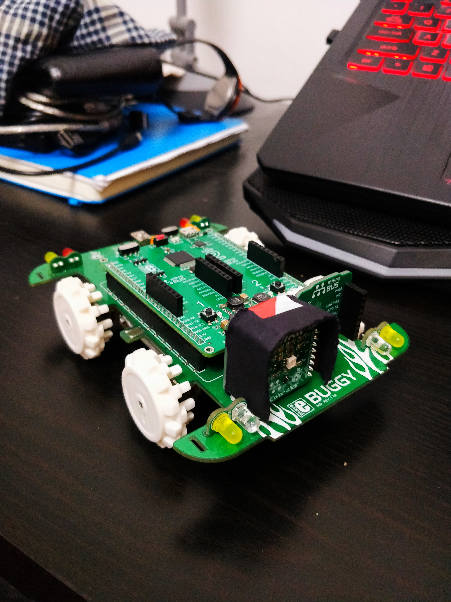
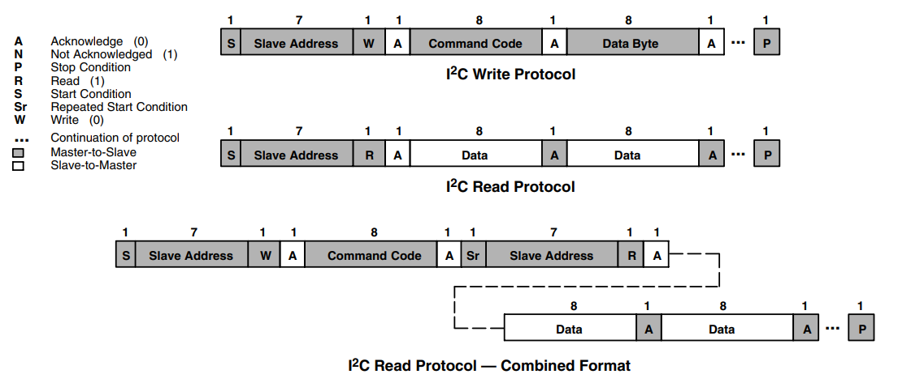

# Final project - SMART Buggy - Dharshannan and Pablo
## Table of contents
- [Instructions to users](#instructions-to-users)
- [Hardware setup](#hardware-setup)
- [Demonstration video](#demonstration-video)
- [Colour Calibration](#colour-calibration)
- [Lost Capability](#lost-capability)
- [Program structure](#program-structure)
- [Challenge brief](#challenge-brief)
- ["Mine" environment specification](#mine-environment-specification)
- [Resources and project submission](#resources-and-project-submission)
- [Supplementary technical information](#supplementary-technical-information)


## Instructions to users
To start the buggy, the RF2 button is pressed. When the buggy returns to its original position (starting position) it enters sleep mode, the reset button is to be pressed to restart the buggy or alternatively, the user can turn OFF and after a short period turn ON the power of the buggy.


## Hardware setup
Our hardware has been set up as below:
- The **LED on pin RH3** is used as to signal when the buggy has detected a colored card.
- The **LED on pin RD7** is used as to signal when the buggy has detected the white card and is turned ON for the period of track back mode until the buggy has reached   its starting position.
- The **Colour Clicker LEDs** is used to detect the colours as RGB values and provide illumination.

Image of Buggy:



## Demonstration video
Our video demonstrates the operation of the buggy in the medium level maze, showing that it works for almost all colours.

(https://www.youtube.com/watch?v=uHknbKGVIsA&t=9s)

## Colour Calibration
The color calibration is done by first collecting 100 RGB values over a span of 25 seconds for each colored card via serial and appending these values into a text file via RealTerm. The text files are then imported into Python and the average RGB values are calculated for each card. These average values are then coded onto the color.c file with defined confidence intervals. Snippet of the Python code is provided below, however to view the full code and text files used for the calibration, these can be found in the **Calibration folder** in the main branch of this repository.

Python code snippet:
```
# =============================================================================
# Now we will process the data !!!
# =============================================================================
percentage = [] # Holds %distribution values for each data point
for i in range(0, len(Red2)):
    # Calculate distribution values for each RGB values
    distR = Red2[i]/(Red2[i] + Green[i] + Blue[i]) 
    distG = Green[i]/(Red2[i] + Green[i] + Blue[i])
    distB = Blue[i]/(Red2[i] + Green[i] + Blue[i])
    # Append these values
    percentage.append([distR,distG,distB])

#print(percentage)
percentage = np.array(percentage) # Turn to numpy array
# Now we average to get an average value for each RGB distribution
avgRED = sum(percentage[:,0])/len(percentage)
avgGREEN = sum(percentage[:,1])/len(percentage)
avgBLUE = sum(percentage[:,2])/len(percentage)

print(avgRED,avgGREEN,avgBLUE) # Print the average RGB values
# Calculate standard deviation for each RGB values also
stdRED = st.stdev(percentage[:,0])
stdGREEN = st.stdev(percentage[:,1])
stdBLUE = st.stdev(percentage[:,2])

print(stdRED, stdGREEN, stdBLUE) # Print the standard deviation of RGB values
```

## Lost Capability
The buggy is programed to enter tack back mode when it is lost, most significantly when it gets stuck. When the buggy is stuck for a period of time, it is programmed to keep track of how long it is stuck for and deducts this time from the forward movement for its track back array. The code below highlights how this is achieved within the main_motor.c file:
```
 // Initialize color detected variable
    unsigned char color_detected = 0;
    unsigned char lost_timer = 0; // To keep track of how long the Buggy has not read a card for
    
    while (PORTFbits.RF2); //empty while loop (wait for button press)
    color_flag = 0; // Incase there's an unwanted trigger
    WhiteLight(); // Turn on the white light
    while (1){
        //Update_RGBC(&initial_color); // Update the RGBC values
        //color_detected = detect_color(&initial_color); // Pass initial color values into detect color function
        // While loop to continue moving Buggy forward while color detected is null (0)
        unsigned int b = 0; // Variable to store forward movement time
        while(color_detected == 0){
            fullSpeedAhead(&motorL,&motorR);
            Update_RGBC(&initial_color); // Update the RGBC values
            color_detected = detect_color(&initial_color); // Pass initial color values into detect color function 
            b++; // Increment b
            // Lost Track back dependencies
            if(initial_color.C > 1900 && initial_color.C < 2200){ // If it hits a wall (Blackish Brown wall) (*These clear values may require calibration)
                lost_timer++; // Increment the lost timer
            }
            // If the buggy is stuck at the black wall for an extended period flag lost flag and set color detected to white (track back mode)
            if(lost_timer>100){
                lost_flag = 1;
                color_detected = 8;
            }
        }
	.
	.
	.
	.
	.
	// If color detected is white, start the track back sequence
        else if(color_detected == 8){
            // Append values depending on lost flag
            if(lost_flag){AppendTime((b-lost_timer-6),&time_index,time_array);} // Append the value of b (forward incrementation variable) to the time array (*minus 6 to avoid overshoot)
            else{AppendTime((b-6),&time_index,time_array);}
```
The above code shows how the lost track back is achieved, by setting the color_detected to white when the buggy is lost (stuck), which in turn initiates the track back mode.

Demonstration video of lost capability:
(https://imperiallondon.sharepoint.com/:v:/s/ECM-ME/ESC_FXGhF5BNtCdX6YW23tcBz2LB3_Vin3qPxFECxT0U7A?e=kGdi9E)


## Program structure
Our program has been structured as follows:
1. ```"main.c"```

	We define the main structures used along the code and the basic instructions to be completed by the buggy when colours are detected. 

	The source file contains our main function. We start by manually the initial color values for Red, Green, Blue and Clear. We also start the initialization sequences for the colour clicker, LED, Interrupts and Timer0. We then proceed by defining the two strcutures for both right and left motors and set the PWM period to 99. 

1. ```"color.c/h"```

    The header file defines a structure ```RGB_val``` which is used throughout the project:
    ```
    typedef struct RGB_val {
        unsigned int R;
        unsigned int G;
        unsigned int B;
        unisgned int C;
    } RGB_val;
    ```
    
    The source file contains 2 key sets of functions:
    - The colour clicker initialization functions. Allows the color clicker to detect Red, Green Blue and Clear
    - ```detect_color(RGB_val *tempval)``` which initialises the color detected and checks which colour it has detected given the confidence of the value and confidence intervals are manually set after extensive data analysis. 

1. ```"color_instructions.c/h"```

    The header file contains the function prototypes from the corresponding source file.
    
    The source file contains functions that contain the instructions to be performed by the buggy for every colour as well as the inverse functions when needed for the white card instructions.

1. ```"dc_motor.c/h"```

    The header file defines a structure ```DC_motor``` which is used throughout the project:
    ```
    typedef struct DC_motor {
        signed char power;
        char direction;
        char brakemode;
        unsigned int PWMperiod;
        unsigned char *posDutyHighByte;
        unsigned char *negDutyHighByte:
    } DC_motor;
    ```
    
    The source file contains functions that initialise the different movements that the buggy can make as well as initialising the DCmotors PWM and setting the motor PWM. Some of the movements mentioned include moving forwards, backwards, breaking, turning right and turning left. 

1. ```"i2c.c/h"```
    
    Here we define functions for I2C communications between the color click and the clicker board.


1. ```"interrupts.c/h"```
    
    The header file contains the function prototypes from the corresponding source file.

    The source file turns on interrupts, and defines:
    - a high priority interrupt every time the buggy detects a colour;
    ```
	    void __interrupt(high_priority) HighISR()
	{
	    //add your ISR code here i.e. check the flag, do something (i.e. toggle an LED), clear the flag..

	    /****************************************************
	    // Here we interrupt to check if color card is found
	    *****************************************************/

	    if(PIR0bits.INT1IF){ // If the flag is raised (clear channel value is outside of threshold range)
		color_flag = 1; // Raise flag for colored card detection
		//LATHbits.LATH3 = !LATHbits.LATH3; // Turn ON and OFF LED for debugging purposes
		interrupts_clear_colorclick(); // Clear colorclick interrupts
		PIR0bits.INT1IF = 0; // Clear interrupt flag
	    }

	}
    ```
    - a low priority interrupt every time the timer overflows (1 second has passed).

1. ```"LED_Buttons.c"```
    
    The header file contains the function prototypes from the corresponding source file.
    
    The source file contains functions to initialie all the LED's and buttons and the function to turn on all the red, green and blue LEDs to produce white light on the color clicker

1. ```"Memorization.c/h"```
    
    The header file contains the function prototypes from the corresponding source file and initialises move index and arrays to be global variables.  
    
    The source contains functions to hold in memory the time the buggy moves forward and the moves it has made
    
1. ```"serial.c/h"```

    The source file contains functions to send information to a computer through the serial port


1. ```"timers.c/h"```

    The header file defines the prescaler values and Timer0 initial bits for both the "testing mode" and "normal mode".
    
    The source file initialises Timer0 to be used in the low priority interrupt (to increment out time each second).
    


# Course project - Mine navigation search and rescue

## Challenge brief

Your task is to develop an autonomous robot that can navigate a "mine" using a series of instructions coded in coloured cards and return to its starting position.  Your robot must be able to perform the following: 

1. Navigate towards a coloured card and stop before impacting the card
1. Read the card colour
1. Interpret the card colour using a predefined code and perform the navigation instruction
1. When the final card is reached, navigate back to the starting position
1. Handle exceptions and return back to the starting position if final card cannot be found

## "Mine" environment specification

A "mine" is contstructed from black plywood walls 100mm high with some walls having coloured cards located on the sides of the maze to assist with navigation. The following colour code is to be used for navigation:

Colour | Instruction
---------|---------
Red | Turn Right 90
Green | Turn Left 90
Blue | Turn 180
Yellow | Reverse 1 square and turn right 90
Pink | Reverse 1 square and turn left 90
Orange | Turn Right 135
Light blue | Turn Left 135 
White | Finish (return home)
Black | Maze wall colour

Mine courses will vary in difficulty, with the simplest requiring 4 basic moves to navigate. More advanced courses may require 10 or moves to navigate. The mines may have features such as dead ends but colour cards will always direct you to the end of the maze. Once the end of the maze has been reached, you must return to the starting position. An example course to navigate is shown below. You do not know in advance which colours will be in the course or how many.


## Resources and project submission

To develop your solution you have your Clicker 2 board, buggy and colour click add on board. You must not use any hardware that is not provided as part of this course and you must use the XC8 compiler to compile your C code. 

Please use this GitHub repo to manage your software development and submit your project code. 

Final testing will take place in the CAGB foyer and testing areas will be provided around the mechatronics lab. You will not know the exact layout of the maze(s) in advance. You will also be asked to give a short presentation on the testing day.

## Supplementary technical information

### Additional buggy features

In addition to the motor drives we explored in lab 6, the buggy contains some additional features that may be of use during the project. The first feature is additional LEDs, controlled through the pins labelled **H.LAMPS**, **M.BEAM**, **BRAKE**, **TURN-L** and **TURN-R**. H.LAMPS turns on the front white LEDs and rear red LEDs, at a reduced brightness. M.BEAM and BRAKE enable you to turn these LEDs on at full brightness. The turn signals have not hardware based brightness control. These LEDs give you a method to provide feedback for debugging, in addition of the LEDs on the clicker board.


A further feature of the buggy is **BAT-VSENSE** pin which allows you to monitor the batter voltage via an analogue input pin. The battery is connected across a voltage divider, as shown in the diagram below:


The voltage at BAT-VSENSE will always be one third of that at the battery. Measuring this value can be useful for determining if your battery needs charging. You could also use it to calibrate your robot to perform well at different charge levels. 

### Colour click

The Colour click board contains 2 devices to help with navigation, a tri-colour LED for illumination and a 4 channel RGBC photodiode sensor. This combination of two devices (an illumination source and a sensor) allow you a make measurements of the reflected colour of objects near the sensor. The circuit diagram for the Colour click is shown below:


The tri-colour LED is the simpler of the two devices to control. Three separate pins control the red, green and blue LEDs individually, despite them being in a single package. Control via these pins is simple digital on/off control and if any brightness control was required, the user would need program the microcontroller to generate a PWM signal to achieve this.  

The second device on the Colour click is the TCS3471 colour light-to-digital converter. The sensor contains a grid of 4x4 photodiodes, 4 are sensitive to red light, 4 green light, 4 blue light and 4 "clear" light (that is, a range of wavelengths, see datasheet for exact spectral response). When light falls on the photodiode the photons are absorbed and current is generated. This signal is then integrated over time using integrators and sampled by 16 bit on board ADCs. Communication with the device is achieved using an I2C interface. This enables configuration of the device to customise sampling of the data (i.e. integration time, gain, etc.) and to read the 16 bit digital values for each of the RGBC channels. The relative magnitude of these values gives you information about the colour of light that is falling on the sensor. The device can also be configured to send an interrupt signal to the PIC when signal reaches a preset value.

### I2C

The I2C interface widely used in industry for communication between microcontrollers and peripheral integrated circuits (other chips) over short distances. I2C is serial communication bus that enables communication between many devices over a simple 2 wire interface. One wire is the data line (SDA) and is used for both transmission and receiving. The second wire (SCL) is used for a clock signal to ensure all devices are synchronous. To ensure communication of data occurs without problem a message protocol must be followed and understood by all devices on the bus. Devices are termed master and slave devices, with master devices initiation communication to a slave device via unique address for that device. The general sequence of communication between a master/slave over the I2C interface is a follows:

1. Send a Start bit
1. Send the slave address, usually 7 bits
1. Send a Read (1) or Write (0) bit to define what type of transaction it is
1. Wait for an Acknowledge bit
1. Send a data or command byte (8 bits)
1. Wait for Acknowledge bit
1. Send the Stop bit

This is shown pictorial in the figure below:



Although it is possible to program an entirely software based I2C interface, luckily for us our PIC chip has a module dedicated to generating and receiving I2C signals: the Master Synchronous Serial Port Module, or MSSP (see chapter 28 of the PIC datasheet). This module provides methods for sending start/stop/acknowledge bits and allows us to focus on sending/receiving data.

The included i2c.c/h files contain functions to help you get started with I2C communication. The first function below sets up the MSSP module as an I2C master device and configures the necessary pins.

	void I2C_2_Master_Init(void)
	{
		//i2c config  
		SSP2CON1bits.SSPM= 0b1000;    // i2c master mode
		SSP2CON1bits.SSPEN = 1;       //enable i2c
		SSP2ADD = (_XTAL_FREQ/(4*_I2C_CLOCK))-1; //Baud rate divider bits (in master mode)
  
		//pin configuration for i2c  
		TRISDbits.TRISD5 = 1;                   //Disable output driver
		TRISDbits.TRISD6 = 1;                   //Disable output driver
		ANSELDbits.ANSELD5=0;					// disable analogue on pins
		ANSELDbits.ANSELD6=0;					// disable analogue on pins
		SSP2DATPPS=0x1D;      //pin RD5
		SSP2CLKPPS=0x1E;      //pin RD6
		RD5PPS=0x1C;      // data output
		RD6PPS=0x1B;      //clock output
	}
	
Bits with the SSP2CON2 register are set to send the individual start/stop/acknowledge bits used in the protocol. These must only be set when the bus is idle (nothing being sent/received). The I2C_2_Master_Start(), I2C_2_Master_Stop() and I2C_2_Master_RepStart() functions allow you add the necessary bits as defined in the protocol above. Data is sent on the bus using the SSP2BUF register:

	void I2C_2_Master_Write(unsigned char data_byte)
	{
		I2C_2_Master_Idle();
		SSP2BUF = data_byte;         //Write data to SSPBUF
	}

Data is also read using the same SSP2BUF registers. However, to receive data we first need to switch the module into receiver mode. We also need to start the acknowledge sequence to let the slave device know what we have received the data OK. The following function achieves this:

	unsigned char I2C_2_Master_Read(unsigned char ack)
	{
		unsigned char tmp;
		I2C_2_Master_Idle();
		SSP2CON2bits.RCEN = 1;        // put the module into receive mode
		I2C_2_Master_Idle();
		tmp = SSP2BUF;                //Read data from SS2PBUF
		I2C_2_Master_Idle();
		SSP2CON2bits.ACKDT = !ack;     // 0 turns on acknowledge data bit
		SSP2CON2bits.ACKEN = 1;        //start acknowledge sequence
		return tmp;
	}

The functions described so form the basics required for I2C communication with the PIC. To communicate with the TCS3471 onboard the Colour click we first need to know its address. This is listed in the data sheet as 0x29. To send our first byte over the I2C we need to send this address combined with the transaction type (read or write) as defined in the protocol diagram above. This lets the TCS3471 know the message is intended for it and not some other device on the interface. Next we send a byte which is a combination of command type and the register address in the TCS3471 that we want to write to. Finally we the value that we want to write to that register. This sequence is shown in the function below:

	void color_writetoaddr(char address, char value){
		I2C_2_Master_Start();         		//Start condition
		I2C_2_Master_Write(0x52 | 0x00);     //7 bit device address + Write (0) mode (note 0x52=0x29<<1)
		I2C_2_Master_Write(0x80 | address);    //command + register address
		I2C_2_Master_Write(value);    			//value to store in the register
		I2C_2_Master_Stop();          //Stop condition
	}

We then call the function to, for example, turn the device on:

	color_writetoaddr(0x00, 0x01); // write 1 to the PON bit in the device enable register
	
There are additional commands that must be set to initialise the device and many registers that be configured to obtain optimal performance for the sensor in your conditions. It is up to you to carefully read the TCS3471 datasheet and experiment with this.

To read values from the TCS3471 you need to a similar sequence to above but you first need to tell the device which register you want to deal with, before telling the device you want read from it. The example below uses the combined read format to read multiple bytes in sequence. The auto-increment is set so that instead of reading the same register over and over again, it automatically advances to the next one. The example starts at the Red channel low byte address and then automatically advances and reads the associated high byte.

	unsigned int color_read_Red(void)
	{
		unsigned int tmp;
		I2C_2_Master_Start();         //Start condition
		I2C_2_Master_Write(0x52 | 0x00);     //7 bit address + Write mode
		I2C_2_Master_Write(0xA0 | 0x16);    //command (auto-increment protocol transaction) + start at RED low register
		I2C_2_Master_RepStart();
		I2C_2_Master_Write(0x52 | 0x01);     //7 bit address + Read (1) mode
		tmp=I2C_2_Master_Read(1);			// read the Red LSB
		tmp=tmp | (I2C_2_Master_Read(0)<<8); //read the Red MSB (don't acknowledge as this is the last read)
		I2C_2_Master_Stop();          //Stop condition
		return tmp;
	}

Instead of separate functions for each channel you may want to create a structure to store all the values together, and pass a pointer to the function so that all values in the structure can be updated in one operation. An example structure might look like this:

	//definition of RGB structure
	struct RGB_val { 
		unsigned int R;
		unsigned int G;
		unsigned int B;
	};

This concludes the basics of I2C and communication with the colour sensor. Best of luck! 
